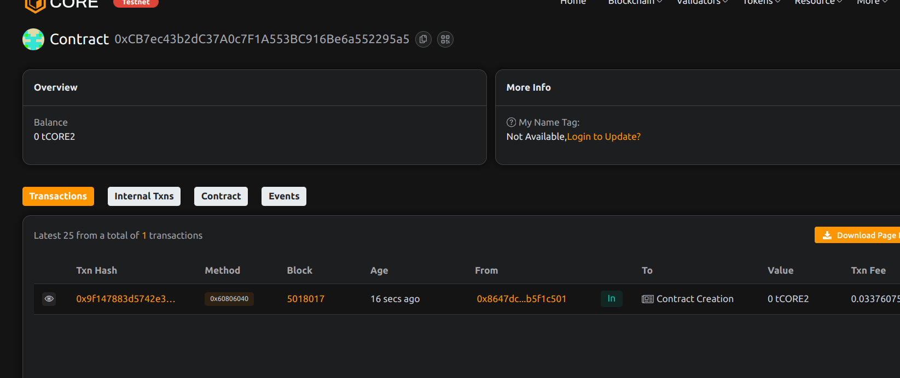

# Project Title: ClaimDAO: IP Dispute Resolution Protocol

  ##  Project Description 

ClaimDAO is a decentralized arbitration system for resolving intellectual property disputes. It allows users to submit claims, vote on them, and reach community-driven resolutions using transparent smart contracts.

  ## Project Vision 

To create a global, community-based arbitration system that removes the need for centralized IP enforcement while preserving creator rights and ownership.

## Key Features

- IP claim submission with metadata
- Community voting to resolve disputes
- Immutable claim and resolution tracking
- On-chain claim status visibility

## Future Scope

- Staking mechanism for voting credibility
- Integration with IPFS or Arweave for evidence storage
- Legal entity DAO partnerships
- Token-incentivized juror system

## Contract Details
project done by Sudhir Raut 
0xCB7ec43b2dC37A0c7F1A553BC916Be6a552295a5
 
